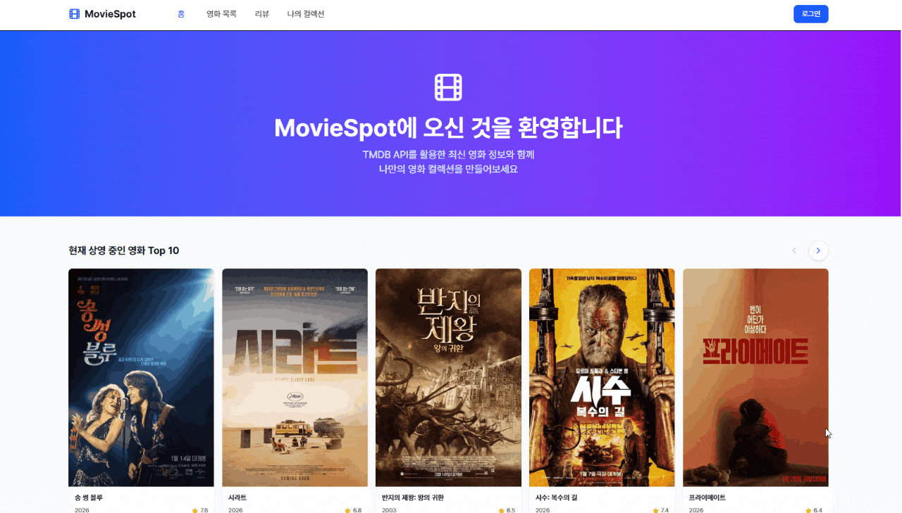

# 🎬 MovieSpot

<div align="center">


### 멋쟁이사자처럼 백엔드 부트캠프 19기: Java <br> 사이드 프로젝트




</div>

- [](https://github.com/star1431)

---

## 1. 프로젝트 정보

### 1.1 개요

영화 검색·리뷰·컬렉션을 중심으로 한 영화 커뮤니티 서비스입니다.<br/>
TMDB 연동, 소셜 로그인, 리뷰/좋아요, 내가 본 영화 관리, 관심 장르/키워드 기록 등 개인화 기능을 제공합니다.


### 1.2 개발기간

- 2026-01-22 ~ 2026-02-06 (약 3주)


### 1.2 주요 기능

- **소셜 로그인** : OAuth2(Client) + JWT 인증 흐름
- **영화 목록** : Top Rated/현재 상영/개봉 예정, 키워드·장르·연도·정렬 검색
- **영화 상세** : TMDB 캐시 + 사용자 평점/코멘트, 내 시청 여부, 트레일러
- **리뷰** : 작성/수정/삭제, 목록(최신/인기/좋아요), 상세, 좋아요 토글
- **나의 컬렉션** : 본 영화 관리, 관심 장르/키워드 설정, 내 리뷰 목록
- **장르** : 앱 시작 시 초기화, 전체 목록 제공

> API는 JWT 기반이며 일부 엔드포인트는 비로그인 접근을 허용합니다. <br> 상세는 하단 문서 링크를 참고하세요.

---

## 2. 기술 스택

### Backend

- **Java** 21
- **Spring Boot** 4.1.0
- **Spring Web** / WebFlux
- **Spring Security** / Spring OAuth2 Client
- **Spring Data JPA**
- **MySQL** 8.0
- **JJWT** 0.12.6

### Frontend

- **Next.js** 16.1.4
- **React** 19.2.3
- **Axios** 1.13.4
- **Tailwind CSS** 4
- **Lucide React** 0.563.0
- **Swiper** 10.2.0

### Infrastructure

- **Docker**
- **Docker Compose**
- **Nginx** 1.25 (alpine)
- **GitHub Actions**

### external API

- **TMDB API** v2

---

## 3. 프로젝트 구조

```bash
moviespot/
├── docker-compose.dev.yml        # 로컬 개발용 Compose
├── docker-compose.prod.yml       # 배포용 Compose
├── nginx.conf                    # Nginx 리버스 프록시 설정
├── backend/                      # Spring Boot 백엔드
│   ├── build.gradle
│   ├── src/
│   │   ├── main/{java,resources}
│   │   └── test/
│   └── Dockerfile
├── frontend/                     # Next.js 프론트엔드
│   ├── src/{app,components,hooks,lib}
│   ├── public/
│   ├── package.json
│   └── Dockerfile
└── docs/                         # 프로젝트 문서 및 트러블슈팅
	├── 01_project_dev.md
	├── 02_project_design.md
	├── 03_erd.md
	├── 04_tmdb_api.md
	├── 05_api_spec.md
    └── 06_deploy.md
```

---

## 4. 프로젝트 문서

| 구분 | 링크 |
|------|------|
|🚩 개발 환경/실행가이드 | [docs/01_project_dev.md](docs/01_project_dev.md) |
|🔀 설계 및 플로우 | [docs/02_project_design.md](docs/02_project_design.md) |
|🗃️ ERD 설계 | [docs/03_erd.md](docs/03_erd.md) |
|📡 TMDB 연동 정리 문서 | [docs/04_tmdb_api.md](docs/04_tmdb_api.md) |
|📡 API 명세서 | [docs/05_api_spec.md](docs/05_api_spec.md) |
|☁️ AWS 배포 가이드 | [docs/06_deploy.md](docs/06_deploy.md) |


백엔드/프론트 상세는 각 폴더에서 확인하세요:

- Backend : [backend/](backend/)
- Frontend : [frontend/](frontend/)

---
