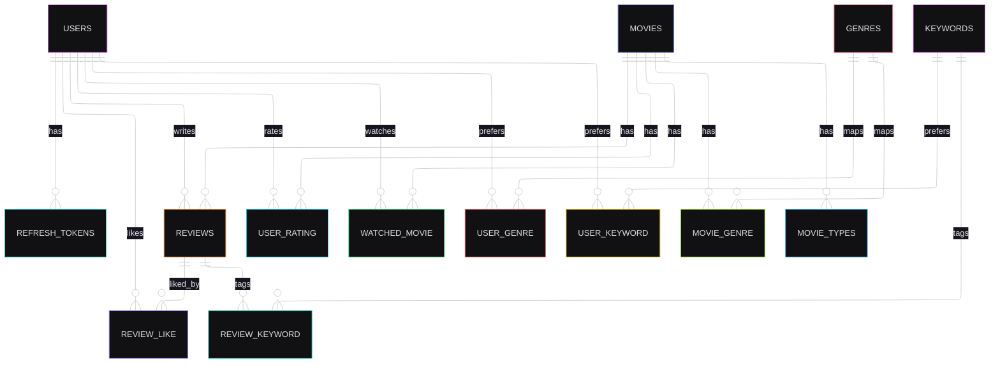
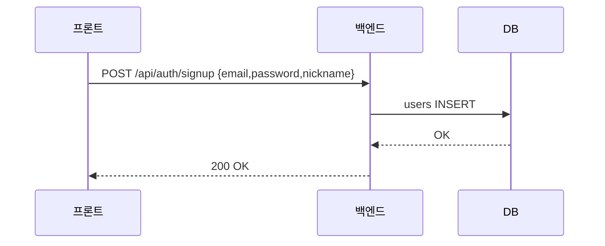
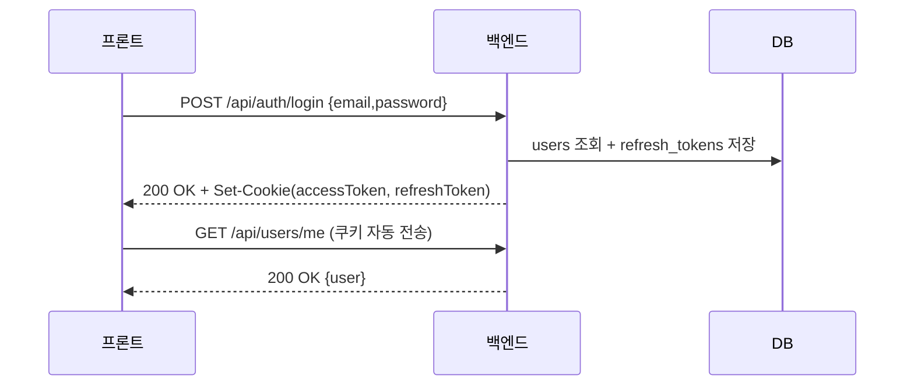
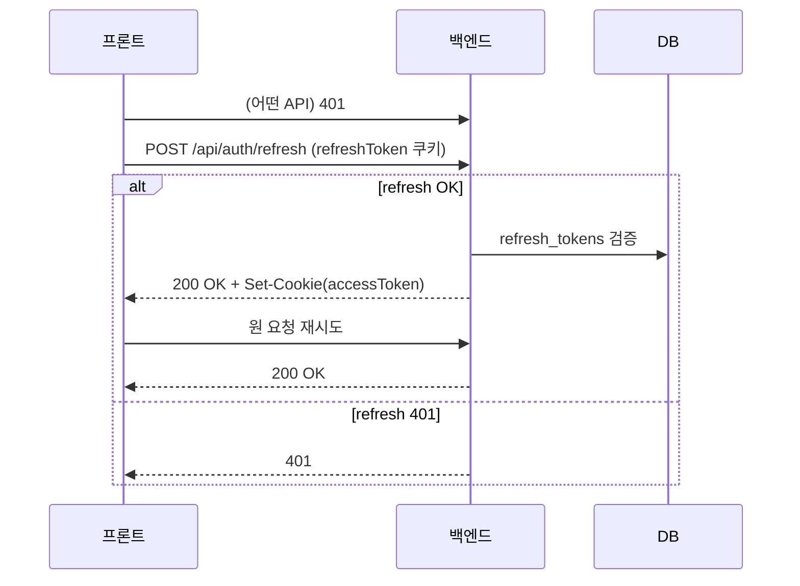
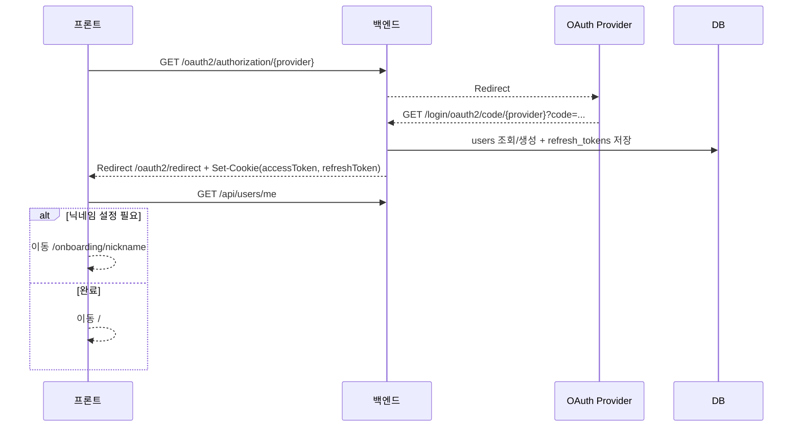
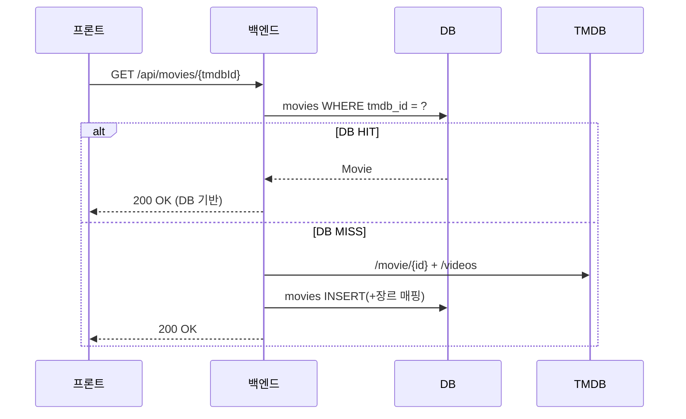
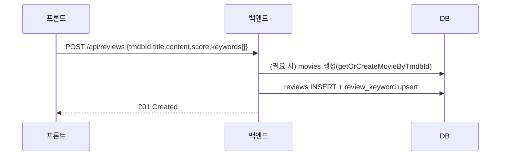
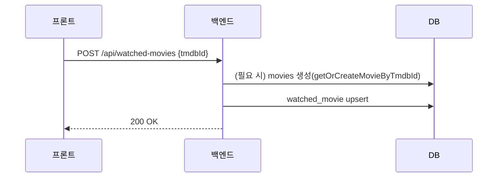

# MovieSpot - 프로젝트 설계 및 플로우

## 목차

0. [프론트엔드 URL 구조](#0-프론트엔드-url-구조)
1. [데이터베이스 관계](#1-데이터베이스-관계)
2. [에러 처리](#2-에러-처리)
3. [유저/인증 흐름](#3-유저인증-흐름)
4. [영화 흐름](#4-영화-흐름)
5. [리뷰 흐름](#5-리뷰-흐름)
6. [나의 컬렉션 흐름](#6-나의-컬렉션-흐름)

---

## 0. 프론트엔드 URL 구조

### 0.1 인증/프로필 관련 페이지

| URL | 설명 | 인증 필요 |
|-----|------|----------|
| `/` | 홈(상영중/인기 영화) | ❌ |
| `/login` | 로그인(이메일/소셜) | ❌ |
| `/signup` | 회원가입 | ❌ |
| `/oauth2/redirect` | OAuth2 콜백 처리(프론트) | ❌ |
| `/onboarding/nickname` | 소셜 로그인 신규 유저 닉네임 설정 | ✅ |
| `/profile` | 프로필(닉네임 변경) | ✅ |

### 0.2 영화 관련 페이지

| URL | 설명 | 인증 필요 |
|-----|------|----------|
| `/movies` | 영화 목록/탭/필터 | ❌ |
| `/movies/[tmdbId]` | 영화 상세(평점/리뷰/본영화) | ❌ *(쓰기만 ✅)* |

### 0.3 리뷰/컬렉션 관련 페이지

| URL | 설명 | 인증 필요 |
|-----|------|----------|
| `/reviews` | 리뷰 목록 | ❌ |
| `/reviews/[reviewId]` | 리뷰 상세 | ❌ *(좋아요/삭제는 ✅)* |
| `/reviews/create` | 리뷰 작성 | ✅ |
| `/collection` | 나의 컬렉션(관심장르/관심키워드/본영화/내리뷰) | ✅ |

---

## 1. 데이터베이스 관계

### 1.1 엔티티 관계도(ERD)
프로젝트 ERD는 `docs/02_erd.md`에 최신 반영되어 있으며, 핵심 관계는 아래와 같습니다.



### 1.2 주요 제약사항(요약)
- **movies**
  - `tmdb_id` UNIQUE
- **watched_movie**
  - UNIQUE(user_id, movie_id)
  - score 기능 제거(점수 컬럼 없음)
- **user_rating**
  - UNIQUE(user_id, movie_id)
- **review_like**
  - UNIQUE(review_id, user_id)
- **review_keyword**
  - UNIQUE(review_id, keyword_id)
- **movie_genre / user_genre / user_keyword**
  - 각각 UNIQUE(매핑 키 2개)

---

## 2. 에러 처리

### 2.1 주요 에러 케이스
- **401 UNAUTHORIZED**
  - accessToken 만료 또는 미로그인 상태에서 인증이 필요한 API 호출
  - refreshToken 쿠키가 없거나 만료되어 `/api/auth/refresh` 실패
- **403 FORBIDDEN**
  - 본인 리소스가 아닌데 수정/삭제 등 권한이 필요한 요청을 수행
- **500 INTERNAL SERVER ERROR**
  - 서버 내부 예외(이전에는 `/error` 보호로 401로 오인될 수 있었고, 현재는 `/error` permitAll 처리)

### 2.2 에러 응답(개념)
API 요청에서 인증/인가 실패 시 JSON 형태로 응답될 수 있습니다.

```json
{
  "error": "UNAUTHORIZED"
}
```

---

## 3. 유저/인증 흐름

### 3.1 회원가입



### 3.2 이메일 로그인(쿠키 기반 JWT)



### 3.3 액세스 토큰 만료 시 자동 갱신
- 프론트 axios interceptor가 401 발생 시 `POST /api/auth/refresh`를 1회 시도하고 성공하면 원 요청을 재시도
- refreshToken 쿠키가 없거나 만료된 경우 401 → 재로그인 필요



### 3.4 OAuth2 소셜 로그인(구글/네이버/카카오)



---

## 4. 영화 흐름

### 4.1 홈(요약 리스트, DB 조회)
- `GET /api/movies/now-playing` (DB)
- `GET /api/movies/top-rated` (DB)

### 4.2 영화 목록(실시간, TMDB 직접)
- `GET /api/movies/now-playing/list`
- `GET /api/movies/top-rated/list`
- `GET /api/movies/upcoming/list`

### 4.3 영화 찾기(필터)
- `GET /api/movies`
  - `keywordType=title`(기본): TMDB 제목검색/Discover 기반
  - `keywordType=review`: DB(리뷰 키워드 기반) 영화 검색

### 4.4 영화 상세(DB 우선)
규칙:
- DB에 영화가 있으면 **DB만 사용**(TMDB로 보강/업데이트 하지 않음)
- DB에 없으면 TMDB 상세를 조회하고 **DB에 저장**한 뒤 응답



---

## 5. 리뷰 흐름

### 5.1 리뷰 목록 조회
- `GET /api/reviews?page&size&sortBy&keyword&movieTitle`
  - `keyword`: 리뷰 키워드(데이트/혼자/힐링 등)
  - `movieTitle`: 영화 제목 부분 검색

### 5.2 리뷰 작성



### 5.3 리뷰 좋아요/삭제
- 좋아요 토글: `POST /api/reviews/{reviewId}/like`
- 삭제: `DELETE /api/reviews/{reviewId}` (작성자만)

---

## 6. 나의 컬렉션 흐름

### 6.1 초기 로드
- `GET /api/genres`
- `GET /api/users/me/genres`
- `GET /api/users/me/keywords`
- `GET /api/users/me/watched-movies`
- `GET /api/users/me/reviews`

### 6.2 관심 장르/키워드 관리
- 관심 장르 추가/삭제:
  - `POST /api/users/me/genres`
  - `DELETE /api/users/me/genres/{genreId}`
- 관심 키워드 추가/삭제:
  - `POST /api/users/me/keywords`
  - `DELETE /api/users/me/keywords` (body로 keywordName)

### 6.3 본 영화 등록(점수 없음)


