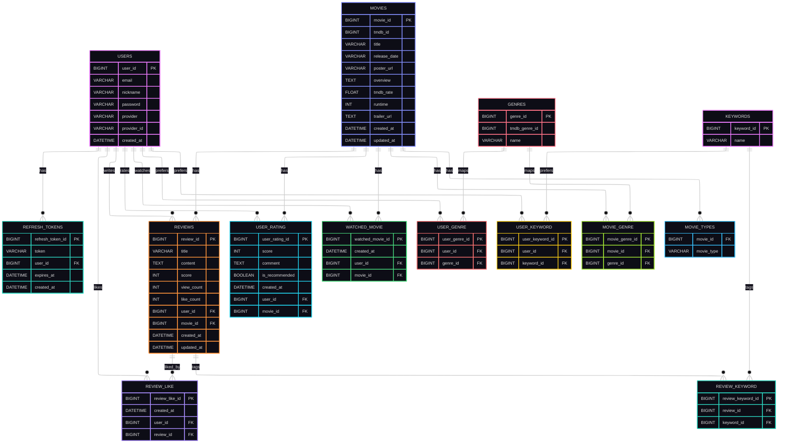

# MovieSpot - ERD 설계

## ERD (Mermaid)

---

## 테이블 상세(컬럼/제약/설명)

### `users` (Users)
- 영화 서비스 사용자 정보

| 컬럼명 | 타입 | 제약 | 설명 |
| --- | --- | --- | --- |
| user_id | BIGINT | **PK** | 사용자 고유 ID |
| email | VARCHAR | **UNIQUE**, **NOT NULL** | 이메일 |
| nickname | VARCHAR | **UNIQUE**, **NOT NULL** | 닉네임 |
| password | VARCHAR |  | 비밀번호(소셜 로그인 사용자는 null 가능) |
| provider | VARCHAR | **NOT NULL** | 로그인 제공자(예: google/naver/kakao/local) |
| provider_id | VARCHAR | **NOT NULL** | 제공자 측 사용자 식별자 |
| created_at | DATETIME | **NOT NULL** | 생성일시 |

---

### `refresh_tokens` (RefreshTokens)
- 리프레시 토큰 저장(서버 검증용)

| 컬럼명 | 타입 | 제약 | 설명 |
| --- | --- | --- | --- |
| refresh_token_id | BIGINT | **PK** | 리프레시 토큰 row ID |
| token | VARCHAR(500) | **UNIQUE**, **NOT NULL** | 리프레시 토큰 문자열 |
| user_id | BIGINT | **FK(users.user_id)**, **NOT NULL** | 사용자 ID |
| expires_at | DATETIME | **NOT NULL** | 토큰 만료 일시 |
| created_at | DATETIME | **NOT NULL** | 생성 일시 |

---

### `movies` (Movies)
- 영화 정보 데이터

| 컬럼명 | 타입 | 제약 | 설명 |
| --- | --- | --- | --- |
| movie_id | BIGINT | **PK** | 영화 고유 ID(내부 DB) |
| tmdb_id | BIGINT | **UNIQUE**, **NOT NULL** | TMDB 영화 ID |
| title | VARCHAR | **NOT NULL** | 영화 제목 |
| release_date | VARCHAR |  | 개봉일(문자열) |
| poster_url | VARCHAR |  | 포스터 URL |
| overview | TEXT |  | 줄거리 |
| tmdb_rate | FLOAT |  | TMDB 평점 |
| runtime | INT |  | 러닝타임(분) |
| trailer_url | TEXT |  | 대표 트레일러 URL(YouTube) |
| created_at | DATETIME | **NOT NULL** | 생성일시 |
| updated_at | DATETIME |  | 업데이트일시 |

---

### `movie_types` (MovieTypes)
- 영화가 어떤 목록에 속하는지(인기/상영중 등) 저장하는 조인 테이블(ElementCollection)

| 컬럼명 | 타입 | 제약 | 설명 |
| --- | --- | --- | --- |
| movie_id | BIGINT | **FK(movies.movie_id)** | 영화 ID |
| movie_type | VARCHAR | **NOT NULL** | `POPULAR` / `NOW_PLAYING` |

---

### `genres` (Genres)
- TMDB 장르 마스터

| 컬럼명 | 타입 | 제약 | 설명 |
| --- | --- | --- | --- |
| genre_id | BIGINT | **PK** | 장르 고유 ID(내부 DB) |
| tmdb_genre_id | BIGINT | **UNIQUE**, **NOT NULL** | TMDB 장르 ID |
| name | VARCHAR | **UNIQUE**, **NOT NULL** | 장르명 |

---

### `movie_genre` (MovieGenre)
- 영화-장르 매핑(M:N)

| 컬럼명 | 타입 | 제약 | 설명 |
| --- | --- | --- | --- |
| movie_genre_id | BIGINT | **PK** | 매핑 row ID |
| movie_id | BIGINT | **FK(movies.movie_id)** | 영화 ID |
| genre_id | BIGINT | **FK(genres.genre_id)** | 장르 ID |

제약(테이블 레벨):
- **UNIQUE(movie_id, genre_id)**

---

### `user_genre` (UserGenre)
- 사용자 관심 장르(M:N)

| 컬럼명 | 타입 | 제약 | 설명 |
| --- | --- | --- | --- |
| user_genre_id | BIGINT | **PK** | 매핑 row ID |
| user_id | BIGINT | **FK(users.user_id)**, **NOT NULL** | 사용자 ID |
| genre_id | BIGINT | **FK(genres.genre_id)**, **NOT NULL** | 장르 ID |

제약(테이블 레벨):
- **UNIQUE(user_id, genre_id)**

---

### `keywords` (Keywords)
- 리뷰/관심 키워드 마스터

| 컬럼명 | 타입 | 제약 | 설명 |
| --- | --- | --- | --- |
| keyword_id | BIGINT | **PK** | 키워드 고유 ID(내부 DB) |
| name | VARCHAR | **UNIQUE**, **NOT NULL** | 키워드명 |

---

### `user_keyword` (UserKeyword)
- 사용자 관심 키워드(M:N)

| 컬럼명 | 타입 | 제약 | 설명 |
| --- | --- | --- | --- |
| user_keyword_id | BIGINT | **PK** | 매핑 row ID |
| user_id | BIGINT | **FK(users.user_id)**, **NOT NULL** | 사용자 ID |
| keyword_id | BIGINT | **FK(keywords.keyword_id)**, **NOT NULL** | 키워드 ID |

제약(테이블 레벨):
- **UNIQUE(user_id, keyword_id)**

---

### `reviews` (Reviews)
- 리뷰 게시글

| 컬럼명 | 타입 | 제약 | 설명 |
| --- | --- | --- | --- |
| review_id | BIGINT | **PK** | 리뷰 ID |
| title | VARCHAR | **NOT NULL** | 리뷰 제목 |
| content | TEXT | **NOT NULL** | 리뷰 내용 |
| score | INT |  | 리뷰 별점(1~10) |
| view_count | INT |  | 조회수 |
| like_count | INT |  | 좋아요수 |
| user_id | BIGINT | **FK(users.user_id)**, **NOT NULL** | 작성자 |
| movie_id | BIGINT | **FK(movies.movie_id)**, **NOT NULL** | 대상 영화 |
| created_at | DATETIME |  | 생성일시 |
| updated_at | DATETIME |  | 수정일시 |

---

### `review_keyword` (ReviewKeyword)
- 리뷰-키워드 매핑(M:N)

| 컬럼명 | 타입 | 제약 | 설명 |
| --- | --- | --- | --- |
| review_keyword_id | BIGINT | **PK** | 매핑 row ID |
| review_id | BIGINT | **FK(reviews.review_id)**, **NOT NULL** | 리뷰 ID |
| keyword_id | BIGINT | **FK(keywords.keyword_id)**, **NOT NULL** | 키워드 ID |

제약(테이블 레벨):
- **UNIQUE(review_id, keyword_id)**

---

### `review_like` (ReviewLike)
- 리뷰 좋아요(유저-리뷰 매핑)

| 컬럼명 | 타입 | 제약 | 설명 |
| --- | --- | --- | --- |
| review_like_id | BIGINT | **PK** | 좋아요 row ID |
| created_at | DATETIME |  | 생성일시 |
| user_id | BIGINT | **FK(users.user_id)**, **NOT NULL** | 사용자 |
| review_id | BIGINT | **FK(reviews.review_id)**, **NOT NULL** | 리뷰 |

제약(테이블 레벨):
- **UNIQUE(review_id, user_id)**

---

### `user_rating` (UserRating)
- 영화에 대한 사용자 평점/코멘트

| 컬럼명 | 타입 | 제약 | 설명 |
| --- | --- | --- | --- |
| user_rating_id | BIGINT | **PK** | 사용자 평점 ID |
| score | INT | **NOT NULL** | 점수(1~10) |
| comment | TEXT | **NOT NULL** | 코멘트 |
| is_recommended | BOOLEAN |  | 추천 여부 |
| created_at | DATETIME |  | 생성일시 |
| user_id | BIGINT | **FK(users.user_id)**, **NOT NULL** | 사용자 |
| movie_id | BIGINT | **FK(movies.movie_id)**, **NOT NULL** | 영화 |

제약(테이블 레벨):
- **UNIQUE(user_id, movie_id)**

---

### `watched_movie` (WatchedMovie)
- 본 영화 기록(점수 기능 제거됨)

| 컬럼명 | 타입 | 제약 | 설명 |
| --- | --- | --- | --- |
| watched_movie_id | BIGINT | **PK** | 본 영화 row ID |
| created_at | DATETIME |  | 등록일시 |
| user_id | BIGINT | **FK(users.user_id)**, **NOT NULL** | 사용자 |
| movie_id | BIGINT | **FK(movies.movie_id)**, **NOT NULL** | 영화 |

제약(테이블 레벨):
- **UNIQUE(user_id, movie_id)**

